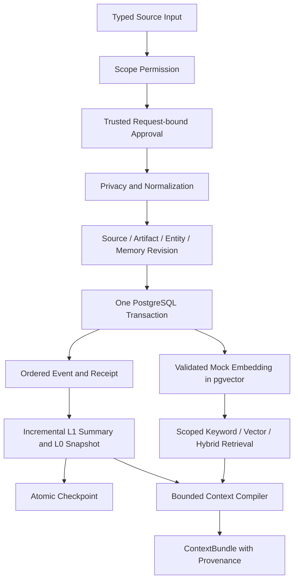

# ShirOS Architecture: Trusted Local Review

## 0.3.1 增量

新增独立 loopback 网页工作台（默认 8001），复用 ReviewWorkflow / Retrieval；旧 8000 API 仍保持健康检查入口。静态 HTML/CSS/JS 无 CDN、无外部资源请求。浏览器文件内容只作为有界内存输入，不写服务器 inbox。

网页授权使用随机进程会话令牌，保存在 OS 账户专属权限的 `.local/browser-session`；`shiros open` 使用 URL fragment 传递给同机浏览器，页面随即移除 fragment 并保留在 sessionStorage。令牌不嵌入公开 HTML、不写日志、不进入报告。Host / Origin / Fetch Metadata / 自定义请求头 / CSP / no-store 限制跨站访问。它是本机能力凭据，不是公网或多人登录体系。

批准请求绑定候选 revision，过期视图必须重新审核；界面未保存的编辑不能直接批准。迁移 `0004_browser_intake` 区分 manual-browser-input 与 manual-local-file，不改写既有历史来源。

## 当前实现

Python 模块化单体，Pydantic 类型契约、SQLAlchemy Core 参数化 SQL、Alembic migration、PostgreSQL + pgvector。Step Two 增加真实持久化闭环，保留独立 ConversationProvider/AgentWorker。

真实资料入口为同步 ReviewWorkflow 服务和 shiros review 本机控制台；build_shared_memory 为可信内部组合入口，memory-demo 仍只写合成内容。HTTP 仅健康检查，没有匿名数据写入或审阅接口；不启动自动后台 Agent。

## 数据模型与历史

10 个核心对象均有正式关系表：Entity、Relation、Source、Artifact、Memory、Event、Summary、Snapshot、Checkpoint、Inference。辅助表承载向量、推断证据、幂等回执和事件时钟，不使用万能 JSON 内容表。

UUID 是内部身份；UTC TIMESTAMPTZ 是时间存储；schema_version 当前为 1。内容记录包含 source_id、observed_at、actor UUID、fact level、confidence、verified、reviewed_by 与隐私元数据。Source 的 provenance 指向自身；Checkpoint 通过事件序号追踪输入范围。

Memory 的 memory_id 跨版本稳定，id 标识不可变版本。revision 递增且 supersedes_id 指向前一版本。唯一约束和数据库 trigger 防止分叉、断链及历史 UPDATE/DELETE。更新同时创建新的 Source/Artifact，原有来源不覆盖。Entity 目前为不可变身份记录，尚无实体编辑产品流程。

Inference 始终以 inference、verified=false 保存，并关联明确的 Memory revision 证据；不能自动变成 Fact。各 fact level 使用稳定语言无关 code。

## 隐私边界

客户端 MemoryWrite/InferenceWrite 不含 reviewed、persistence_allowed、verified。ReviewAuthority 由可信本地应用持有，要求 reviewer 对 scope 的 review 权限。随机批准 ID 绑定完整原始请求、actor、reviewer，30 分钟后过期；批准及原始请求指纹只在内存中存在。

写入先验证权限与批准，再检查原文及 NFKC 规范化后的全文。禁止内容在任何 SQL 内容写入前拒绝；允许内容先脱敏/泛化。持久 Source 的“原始资料”指经过许可与脱敏后的 L2，不是被拒绝的敏感原文。

Summary/Snapshot/Inference 再检查生成正文；Embedding 仅接受已门控 Memory 文本，检查模型、维数、有限数值和非零向量。Event 不提供自由正文 payload。仓储再检查安全文本和同 scope 的已批准 Source；它们是受信内部接口，不是对外权限服务。

禁止记录直接拒绝且不落库，没有先存储再隐藏的旁路。Step Three 使用追加式撤销和可见性记录；正常检索及派生处理统一检查 visibility。物理擦除尚无允许策略，不能把撤销称为删除。

## 事务与增量

MVP 全局 transaction-scoped advisory lock 序列化写入和层处理。事务内 event_clock 增加序号，其锁随提交释放，避免较大序号先提交而让 checkpoint 跳过尚未提交事件。Source、Artifact、Entity/Relation、Memory、Embedding、Event 和回执同事务写入。

同 actor/scope 的幂等键重放返回原版本，不同内容复用同键报冲突。脱敏标准化后的相同 MemoryWrite（排除传输幂等键）可去重；不同 observed_at/来源信息不合并。失败不会保留部分状态或消耗事件时钟。

LayerProcessor 每次取最多 100 个新 memory.created/revised 事件。每个 Memory revision 生成一个 L1 摘要与 L0 快照，保留来源与输入事件范围；摘要、快照、对应派生事件和追加式 Checkpoint 同批提交。只消费 memory 事件，避免反复处理自己的派生事件。

全局锁牺牲吞吐换取单机正确性。真实远程模型不应长期占用数据库事务；引入时须设计 outbox、任务状态和原子完成协议。

## 检索与 Context

exact 支持当前 Memory、指定历史 revision 与 Source。Search 支持 scope、domain、entity、source、observation time 筛选；关键词使用 PostgreSQL full text 加子串匹配；semantic 使用 pgvector cosine distance；hybrid 使用 0.4 keyword + 0.6 semantic。结果含排名、分数、来源、事实等级和置信度。

Context 先按 scope 权限过滤，再按 Snapshot → Summary → Search → Explicit Exact 来源顺序处理。L0/L1 SQL 只返回层内容，不把原始 Memory 正文带回应用用于层查询。每阶段最多 16 个候选，按相关度排名、memory ID/文本去重；正文按预算裁剪，保留完整 provenance，空间不足则不纳入。默认不读取全部历史，Source 正文需 exact_source_ids 显式选择。

预算使用所选 ContextItem 的 UTF-8 JSON 字节保守估算（包括 provenance 和选择元数据，不包括 bundle 外壳），不是模型专用 tokenizer；输出明确标记 estimator、token_budget、trimmed、deduplicated 和阶段。

## 产品双语

Locale 支持 zh-CN/en-US，偏好带 IANA timezone。资源在 i18n/resources.py，lookup 按请求语言 → zh-CN → en-US → key 回退。Plugin 使用独占命名空间注册，不覆盖现有资源。数字/日期/时间按 locale 呈现，不修改进程全局 locale，不翻译或复制用户正文。

## 保持分离与限制

Conversation 仍是独立来源体系，Mock Worker 仍是独立执行对象。Music/Papers/Knowledge/People 领域、真实模型、Gateway、完整前端、Obsidian 插件与双向同步未实现。

规则隐私不是全面 NLP；32 维 signed hash embedding 不是训练语义模型；400 字符前缀摘要和 160 字符快照不是语义压缩。scope 级授权不是细粒度 RLS。本机 review 由进程操作系统 SID/UID 解析身份，CLI 不接受 actor 或 reviewed 参数；拥有数据库凭据或修改本机 Python 代码的用户仍在信任边界内。备份为本机未加密 PostgreSQL custom dump，不能直接上传或作为生产灾备保证。

## Step Three 流程

LocalIdentity 将 OS principal 映射到 UUID；DatabasePermissions 从 local_grants 读取最小角色权限。首次显式初始化绑定 Owner，后续授权要求 scope admin。整库备份/恢复额外要求最初 bootstrap Owner，避免 scope 管理权限跨范围导出资料。

文件选择限制在固定 inbox 的单层 basename，拒绝软链接、junction、硬链接、超限文件及非 UTF-8 内容。Preview 只保留进程内的有限缓存；stage 明确确认后将安全文本写入 review_sources 和 memory_candidates。原始候选指脱敏后的首次候选，不保存被拒绝的秘密原文。原文预览不写日志。

candidate_states 追加保存 pending/edited/approved/rejected/invalidated、操作人、时间和原因码。approve 在同一数据库事务内调用 MemoryService，写正式记忆、向量、事件、来源映射、批准状态和审计；失败全部回滚。同步审核接口供 CLI 使用，异步宿主应通过 asyncio.to_thread 调用。

撤销 intake Source 会同时撤销映射的核心 Source 与稳定 memory_id，候选失效；核心 Source 撤销也回溯对应 intake。Summary/Snapshot/Embedding 留作审计，但查询通过关联 Memory 的统一可见性条件排除。隐藏可追加 show 恢复；show 不会撤销 revoke。层处理跳过已失效输入并推进 checkpoint；隐藏期间被跳过的摘要没有自动补建，恢复后仍可检索原记忆。

设计决策见 ADR 008；操作限制见 review-workflow.md。

## 参考

- [pgvector Python 官方接口](https://github.com/pgvector/pgvector-python)
- [PostgreSQL 事务隔离与序列注意事项](https://www.postgresql.org/docs/16/transaction-iso.html)
- [Alembic 迁移环境](https://alembic.sqlalchemy.org/en/latest/tutorial.html)

